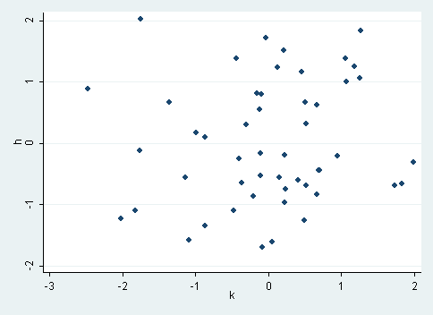

# Regresion 1

Question
========

En la siguiente figura se representa la relación entre dos variables A y B.

¿Cuál es la interpretación corrrecta de esta relación?

Answerlist
----------
* Un aumento en el valor de A causa una disminución de B.  
* Un aumento en el valor de A se asocia a una disminución de B.  
* Los cambios en el valor de A no tienen relación con los cambios en los valores de B.  

Meta-information
================
exname: 01-Regresion 
extype: schoice  
exsolution: 001  
exshuffle: 3  

