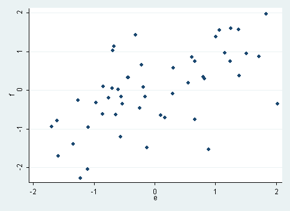

# Regresion 4

Question
========

Un estudio polisomnográfico relacionó una medida de la intensidad del ronquido con la gravedad de la apnea obstructiva del sueño (*J Clin Sleep Med 2010; 15: 475-8*).Los resultados se representan en el siguiente diagrama de dispersión.  

¿Cuál es el valor aproximado del coeficiente de correlación que corresponde a esa gráfica?  

Answerlist
----------
* -0,2
* 0,6
* 0,9

Solution
--------
Feedback

Meta-information
================
exname: 04-Regresion
extype: schoice  
exsolution: 010  
exshuffle: 3  

