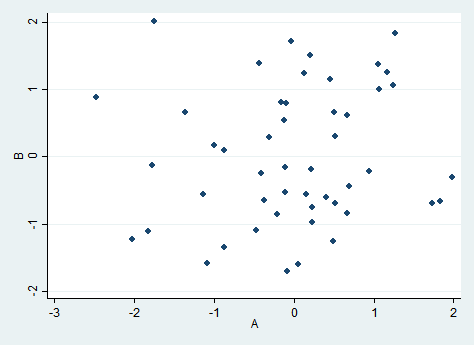

# Regresion 12

Question
========

¿Cuál es el valor aproximado de la covarianza en la relación que se representa en el siguiente diagrama de dispersión?  
 

Answerlist
----------
* Positiva.
* Cero.
* Negativa.

Meta-information
================
exname: 12-Regresion  
extype: schoice  
exsolution: 100  
exshuffle: 3  

