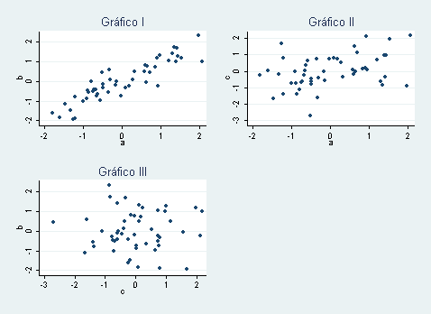

# Regresion 14

Question
========

Los pacientes con enfermedad de Cushing pueden sufrir alteraciones de la elasticidad aórtica. En un reciente estudio, unos investigadores midieron la distensibilidad cardíaca y la longitud aórtica, obteniendo un coeficiente de correlación entre ambas medidas de 0,45 (Endocrine 2010; 37:280-5).  
¿Cuál de los siguientes diagramas representa mejor la relación que encontró este investigador?  

Answerlist
----------
* El gráfico I.  
* El gráfico II.  
* El gráfico III.  

Meta-information
================
exname: 14-Regresion  
extype: schoice  
exsolution: 010  
exshuffle: 3  

