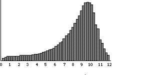

# Inferencia 11

Question
========

El peso corporal en una población se distribuye según lo indicado en la siguiente gráfica.

Si tomamos una muestra aleatoria de 10 estudiantes, ¿cuál es el valor de la media más probable que se puede calcular en esa muestra?

Answerlist
----------
* 2  
* 8  
* 11  

Meta-information
================
exname: 11-Inferencia
extype: schoice  
exsolution: 010  
exshuffle: 3  

