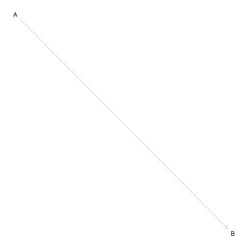
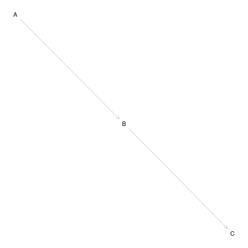
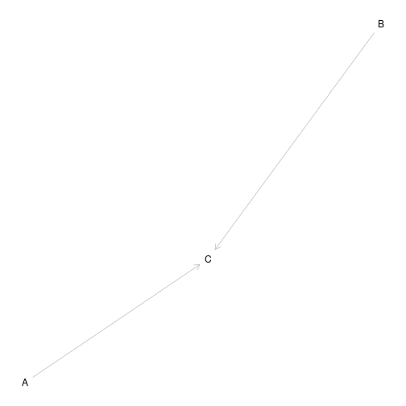
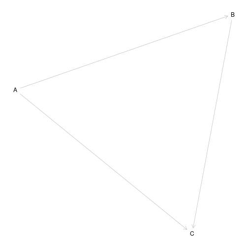
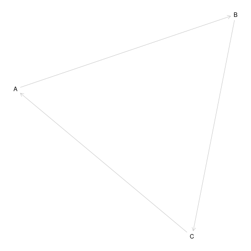

Diagramas o grafos causales
========================================================
author: 
date: 
autosize: true

Introducción
========================================================

Grafos Dirigidos Acíclicos
========================================================

Antepasado y descendiente
========================================================

Colisionador
========================================================

Sesgo de confusión
========================================================

Grafo dirigido cíclico
========================================================

