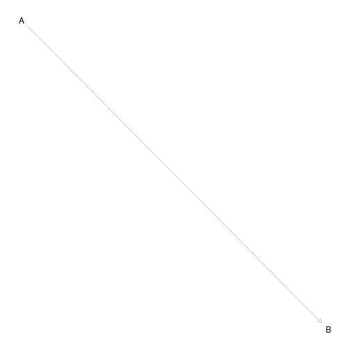
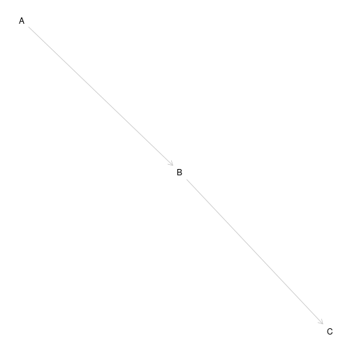
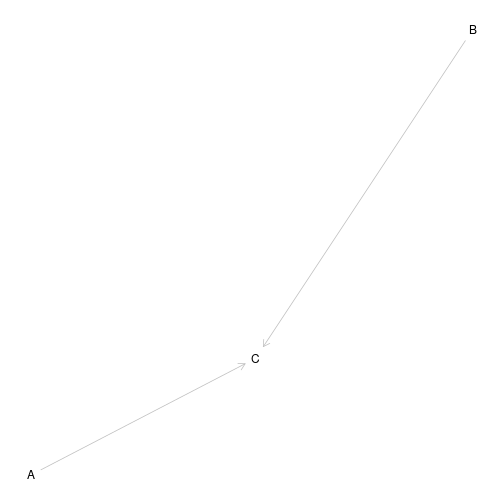
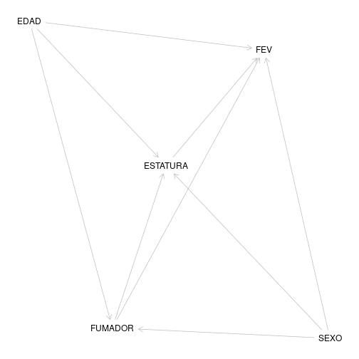
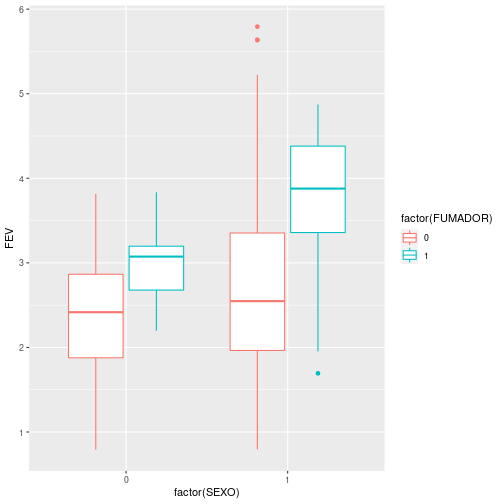
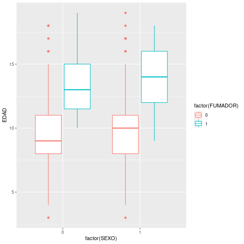
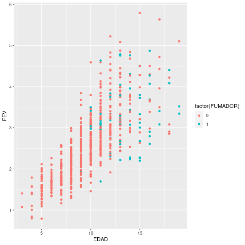

Actividad en clase  
Tabaco y función pulmonar
========================================================
author: 
date: 
autosize: true


Introducción
========================================================

Completaremos el estudio acerca de la función pulmonar en un grupo de adolescentes.  
Las variables que se estudiaron fueron:  
- **Edad**  
- **Sexo**
- **Estatura**
- **Tabaquismo**

Recordatorio de los grafos
========================================================



Cadena
========================================================



Colisionador
========================================================



Bifurcación
========================================================


Pregunta de investigación
========================================================

**¿Qué efecto tiene el consumo de tabaco sobre la función pulmonar?**

Diagrama causal
========================================================

Descripción de las variables
========================================================

```
# A tibble: 2 x 5
  FUMADOR  EDAD   FEV  SEXO ESTATURA
    <int> <dbl> <dbl> <dbl>    <dbl>
1       0  9.53  2.57 0.526     154.
2       1 13.5   3.28 0.4       168.
```

Efecto del sexo
========================================================



Efecto de la edad
========================================================



Relación edad y función pulmonar
========================================================


Procedimientos para controlar el sesgo
========================================================

- Diseño: restricción  
- Análisis:  
* Estratificación  
* Emparejamiento  
* Ajuste

Regresión (1)
========================================================


```

Call:
lm(formula = FEV ~ FUMADOR, data = fev)

Residuals:
    Min      1Q  Median      3Q     Max 
-1.7751 -0.6339 -0.1021  0.4804  3.2269 

Coefficients:
            Estimate Std. Error t value Pr(>|t|)    
(Intercept)  2.56614    0.03466  74.037  < 2e-16 ***
FUMADOR      0.71072    0.10994   6.464 1.99e-10 ***
---
Signif. codes:  0 '***' 0.001 '**' 0.01 '*' 0.05 '.' 0.1 ' ' 1

Residual standard error: 0.8412 on 652 degrees of freedom
Multiple R-squared:  0.06023,	Adjusted R-squared:  0.05879 
F-statistic: 41.79 on 1 and 652 DF,  p-value: 1.993e-10
```

Regresión (2)
========================================================


```

Call:
lm(formula = FEV ~ FUMADOR + EDAD + SEXO, data = fev)

Residuals:
     Min       1Q   Median       3Q      Max 
-1.46707 -0.35426 -0.03811  0.32199  1.94943 

Coefficients:
             Estimate Std. Error t value Pr(>|t|)    
(Intercept)  0.237771   0.080228   2.964  0.00315 ** 
FUMADOR     -0.153974   0.077977  -1.975  0.04873 *  
EDAD         0.226794   0.007884  28.765  < 2e-16 ***
SEXO         0.315273   0.042710   7.382  4.8e-13 ***
---
Signif. codes:  0 '***' 0.001 '**' 0.01 '*' 0.05 '.' 0.1 ' ' 1

Residual standard error: 0.5432 on 650 degrees of freedom
Multiple R-squared:  0.6093,	Adjusted R-squared:  0.6075 
F-statistic: 337.9 on 3 and 650 DF,  p-value: < 2.2e-16
```

Emparejamiento
========================================================


```

Call:
lm(formula = FEV ~ FUMADOR + SEXO + EDAD, data = matched.data, 
    weights = weights)

Weighted Residuals:
    Min      1Q  Median      3Q     Max 
-2.0914 -0.3433 -0.1020  0.2722  2.8436 

Coefficients:
            Estimate Std. Error t value Pr(>|t|)    
(Intercept)  1.25193    0.17810   7.030 9.53e-12 ***
FUMADOR     -0.07114    0.07591  -0.937    0.349    
SEXO         0.78461    0.05836  13.444  < 2e-16 ***
EDAD         0.13239    0.01343   9.857  < 2e-16 ***
---
Signif. codes:  0 '***' 0.001 '**' 0.01 '*' 0.05 '.' 0.1 ' ' 1

Residual standard error: 0.5515 on 384 degrees of freedom
Multiple R-squared:  0.4813,	Adjusted R-squared:  0.4773 
F-statistic: 118.8 on 3 and 384 DF,  p-value: < 2.2e-16
```
