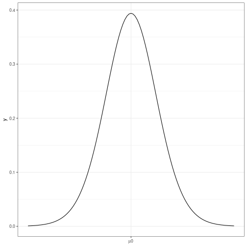
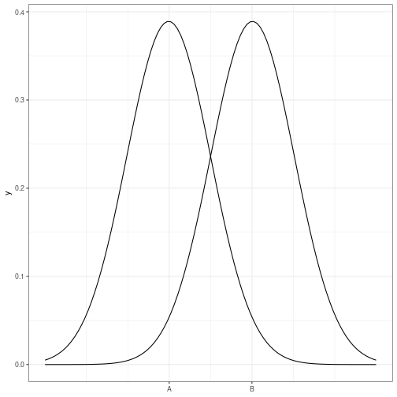

Comparación de medias
========================================================
author: 
date: 
autosize: true


Hipótesis nula
========================================================




Hipótesis alternativa
========================================================



Estadístico del test
========================================================

$$t_{exp} = \frac{\bar{x}_A - \bar{x}_B}{E.T.(\bar{x}_A - \bar{x}_B)} $$  

$$t_{exp} = \frac{\bar{x}_A - \bar{x}_B}{\sqrt{\bar{x}_A/n_A - \bar{x}_B/n_B}} $$ 


Orden de R
========================================================

```r
t.test(ancho.pie~sexo, alternative='two.sided', conf.level=.95, var.equal=FALSE, 
  data=pies1920)
```

Resultado del test bilateral
========================================================

```

	Welch Two Sample t-test

data:  ancho.pie by sexo
t = -1.9529, df = 21.766, p-value = 0.06381
alternative hypothesis: true difference in means is not equal to 0
95 percent confidence interval:
 -3.734159  0.113386
sample estimates:
mean in group Mujer mean in group Varón 
           20.46739            22.27778 
```

Resultado del test
========================================================

```

	Welch Two Sample t-test

data:  ancho.pie by sexo
t = -1.9529, df = 21.766, p-value = 0.03191
alternative hypothesis: true difference in means is less than 0
95 percent confidence interval:
       -Inf -0.2177647
sample estimates:
mean in group Mujer mean in group Varón 
           20.46739            22.27778 
```
