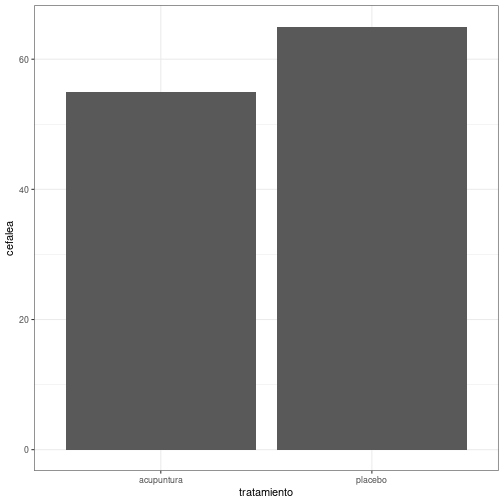
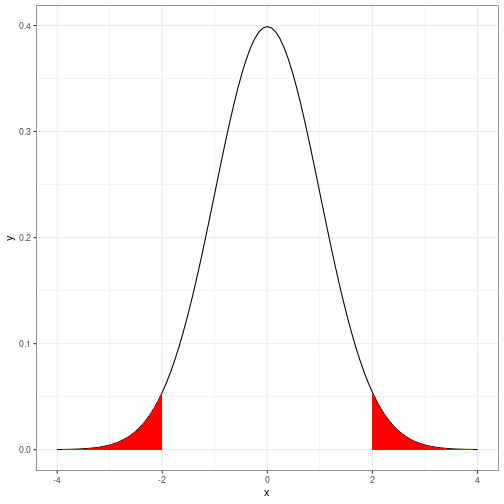
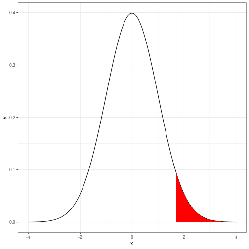
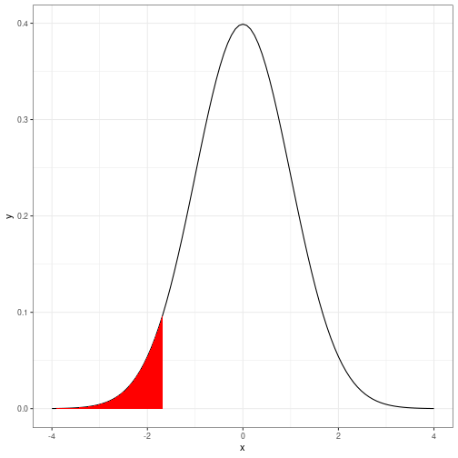

Comparación de proporciones
========================================================
author: 
date: 
autosize: true


El problema
========================================================
Acupuntura como tratamiento de síntomas o molestias dolorosas

El estudio
========================================================


Los resultados
========================================================


Los resultados
========================================================
title: false

- Acupuntura: 51/92  

- Placebo: 60/92


Las hipótesis (1)
========================================================

$$ H_0 : \pi_E = \pi_C $$  
$$ H_1 : \pi_E \neq \pi_C $$  

Otra formulación:  

$$ H_0 : \pi_E - \pi_C = 0 $$  
$$ H_1 : \pi_E - \pi_C \neq 0$$  

La regla de decisión
=========================================================



Las hipótesis (2)
========================================================

$$ H_0 : \pi_E = \pi_C $$  
$$ H_2 : \pi_E > \pi_C $$  

Otra formulación:  

$$ H_0 : \pi_E - \pi_C = 0 $$  
$$ H_2 : \pi_E - \pi_C > 0 $$  

La regla de decisión
=========================================================
title: false



Las hipótesis (3)
========================================================

$$ H_0 : \pi_E = \pi_C $$  
$$ H_3 : \pi_E < \pi_C $$  

Otra formulación:  

$$ H_0 : \pi_E - \pi_C = 0 $$  
$$ H_3 : \pi_E - \pi_C < 0 $$  

La regla de decisión
=========================================================
title: false



La sintaxis
========================================================


```r
prop.test(c(x1,x2),c(n1,n2),alternative = c("two.sided", "less", "greater"))
```

Un ejemplo (1)
========================================================

- **Estudio 1**: 8 éxitos (x1) en 12 pacientes (n1)
- **Estudio 2**: 5 éxitos (x2) en 18 pacientes (n2)


```r
prop.test(c(8,5),c(12,18),alternative = c("two.sided"))
```

```

	2-sample test for equality of proportions with continuity correction

data:  c(8, 5) out of c(12, 18)
X-squared = 2.9921, df = 1, p-value = 0.08367
alternative hypothesis: two.sided
95 percent confidence interval:
 -0.01812442  0.79590220
sample estimates:
   prop 1    prop 2 
0.6666667 0.2777778 
```

Un ejemplo (2)
========================================================


```r
prop.test(c(8,5),c(12,18),alternative = c("greater"))
```

```

	2-sample test for equality of proportions with continuity correction

data:  c(8, 5) out of c(12, 18)
X-squared = 2.9921, df = 1, p-value = 0.04184
alternative hypothesis: greater
95 percent confidence interval:
 0.03614772 1.00000000
sample estimates:
   prop 1    prop 2 
0.6666667 0.2777778 
```

Grafica
=======================================================
title: false


Los resultados de la acupuntura (1)
========================================================
Resultados de la prueba bilateral


```r
prop.test(c(51,60),c(92,92),alternative = c("two.sided"))
```

Los resultados de la acupuntura (2)
========================================================
Resultados de la prueba bilateral


```

	2-sample test for equality of proportions with continuity correction

data:  c(51, 60) out of c(92, 92)
X-squared = 1.4533, df = 1, p-value = 0.228
alternative hypothesis: two.sided
95 percent confidence interval:
 -0.24936280  0.05371063
sample estimates:
   prop 1    prop 2 
0.5543478 0.6521739 
```


Un nuevo estudio (1)
========================================================
* Acupuntura: n=192. Cefalea = 55%
* Placebo: n=192. Cefalea = 65%

Para hacer el test, calcular el número de mujeres con cefalea en cada tratamiento

Un nuevo estudio (2)
========================================================

Resultados de la prueba bilateral


```r
prop.test(c(106,125),c(192,192),alternative = c("two.sided"))
```

```

	2-sample test for equality of proportions with continuity correction

data:  c(106, 125) out of c(192, 192)
X-squared = 3.5202, df = 1, p-value = 0.06062
alternative hypothesis: two.sided
95 percent confidence interval:
 -0.201599104  0.003682438
sample estimates:
   prop 1    prop 2 
0.5520833 0.6510417 
```

Un nuevo estudio (3)
========================================================

Resultados de la prueba unilateral


```r
prop.test(c(106,125),c(192,192),alternative = c("less"))
```

```

	2-sample test for equality of proportions with continuity correction

data:  c(106, 125) out of c(192, 192)
X-squared = 3.5202, df = 1, p-value = 0.03031
alternative hypothesis: less
95 percent confidence interval:
 -1.00000000 -0.01198212
sample estimates:
   prop 1    prop 2 
0.5520833 0.6510417 
```
