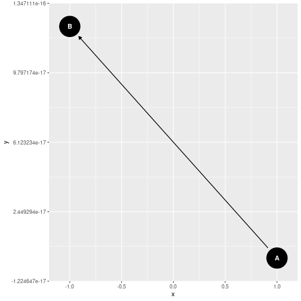
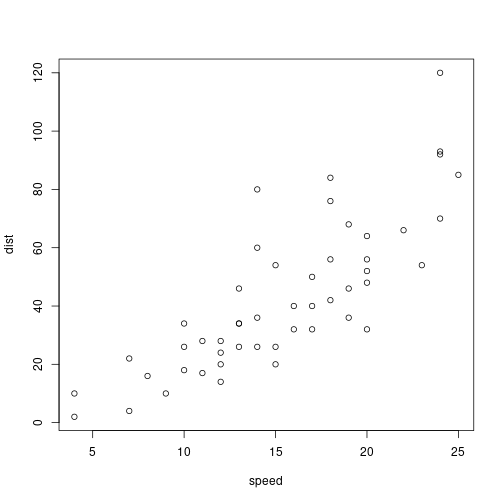

grafos
========================================================
author: Juan Ramón Lacalle
date: 
autosize: true


Introducción
========================================================

For more details on authoring R presentations please visit <https://support.rstudio.com/hc/en-us/articles/200486468>.

- Bullet 1
- Bullet 2
- Bullet 3

Nodos
========================================================


```r
dag <- dagitty("dag{A -> B}")
# tidy_dagitty(dag)
ggdag(dag, layout = "circle")
```



Aristas
========================================================


Grafo dirigido
========================================================


Grafo acíclico
========================================================


Padre e hijo
========================================================


Ascendiente y descendiente
========================================================


Puerta trasera (retrógrado)
========================================================


Colisionador
========================================================


