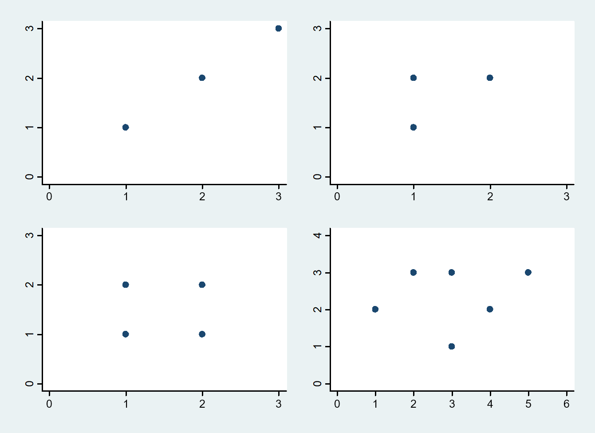

```{r configura, message=FALSE, echo=FALSE}
library(tidyverse)

```

# Introducción
La regresión lineal es el método que usamos para *ajustar* una recta a unas observaciones, en una nube de puntos. De esta manera, cada valor observado de $x$ nos sirve para predecir el valor de $y$. La ecuación de la recta tiene la siguiente forma: 

$y = a + b*x$

La recta de regresión es un **modelo**; mediante esa ecuación podemos predecir de forma más o menos aproximada cómo afecta una variable a los valores de otra variable. Pero, como con cualquier modelo, esas predicciones casi nunca son perfectas. Siempre hay una diferencia entre la predicción y lo observado; y a esa diferencia la llamamos **error**. Cuanto mejor sea el modelo, más pequeño será ese error. En condiciones ideales, el error es cero si el modelo coincide con los datos observados. Pero eso casi nunca se produce.

## Objetivos
Al finalizar esta actividad debes ser capaz de:  

* Explicar el significado de **ajuste** de una recta.  
* Ajustar visualmente una recta a una nube de puntos.  
* Estimar los coeficientes de la recta con R.  
* Interpretar los coeficientes de la recta.  
* Calcular la varianza residual de una recta de regresión.  
* Examinar la validez de una recta.    

Las actividades sobre el ajuste de una nube de puntos, realizadas en clase, las podemos reproducir mediante el programa R.

## Comandos de R
En esta actividad usarás varios comandos de R para estudiar la regresión:  

* `data.frame`: con este comando almacenamos los datos en un fichero.  
* `plot`: representa las variables que se le indican; la primera que aparece se coloca en el eje horizontal, y la segunda en el vertical. También podemos añadir comandos modificadores, como `xlim` e `ylim` para controlar el rango de valores representados en cada eje; y `pch` para que la representación del punto tenga una forma geométrica determinada (en este caso, hemos usado un círculo relleno de color negro).  
* `lines`: para representar una recta, indicando los valores iniciales y finales de $x$ y de $y$.
* `lm`: para ajustar los valores a una recta de regresión. Puede tener subcomandos, como `coef`(para obtener los coeficientes de la recta); `predict`, que calcula el valor predicho por la recta en cada valor de $x$; y `resid`, que calcula los residuales para cada valor de $y$.  
* `abline`: representa gráficamente la recta obtenida con el comando anterior.  

# La actividad
A continuación se presentan cuatro diagramas de dispersión, cada uno con una distribución diferente de los puntos.   


En primer lugar, debes pensar cuál es la recta que mejor se ajusta en cada uno de los cuatro diagramas. Si quieres, puedes dibujar la recta en cada uno de ellos, imprimiendo esta gráfica.   
A cada gráfica la he llamado *escenario 1*, *escenario 2*, etc. Ahora vamos a ver la solución en cada uno de ellos. En los cuatro casos, la variable que representamos en el eje $x$ la consideraremos **variable independiente**, y la que aparece en el eje vertical $y$ como **dependiente**.  

## Escenario 1
En el primer ejemplo, cada valor de $x$ y de $y$ coinciden. Las órdenes para obtener esa gráfica son las siguientes:   
```{r echo=TRUE, eval=FALSE, fig.align="center", fig.width=3.5, fig.height=3.5}
escena1 <- data.frame(x <- c(1,2,3), y <- c(1,2,3))
with(escena1,plot(x,y, xlim=c(0,4), ylim=c(0,4), pch=16))
```

Y este es el resultado que obtendremos:   
```{r,  fig.width=3.5, fig.height=3.5, fig.align="center"}
escena1 <- data.frame(x <- c(1,2,3), y <- c(1,2,3))
with(escena1,plot(x,y, xlim=c(0,4), ylim=c(0,4), pch=16))
```

Este caso es el más sencillo: la nube de puntos la ajustamo con una linea que pasa por cada uno de los tres puntos.
```{r, fig.width=3.5, fig.height=3.5, fig.align="center"}
with(escena1,plot(x,y, xlim=c(0,4), ylim=c(0,4), pch=16))
lines(c(0,4), c(0,4), col="red")
```

En realidad, la recta se debe trazar entre los puntos observados; es decir entre $x = 1$ y $x = 3$.   
```{r, fig.width=3.5, fig.height=3.5, fig.align="center"}
with(escena1,plot(x,y, xlim=c(0,4), ylim=c(0,4), pch=16))
lines(c(1,3), c(1,3), col="red")
```

Pero, al prolongarla hasta $x = 0$, queda más clara la interpretación de la ordenada en el origen, *a*.  

## Escenario 2
En este caso, hay dos individuos con x=1.
```{r, fig.width=3.5, fig.height=3.5, fig.align="center"}
escena2 <- data.frame(x <- c(1,1,2), y <- c(1,2,2))
with(escena2,plot(x,y, xlim=c(0,4), ylim=c(0,4), pch=16))
```

Si ajustamos una recta, con el método de mínimos cuadrados, los coeficientes tienen los siguientes valores:  
```{r}
recta2 <- lm(y~x, data = escena2)
coef(recta2)
```

En la salida del ordenador, encontramos dos valores:  
* *Intercept*, la ordenada en el origen; es decir, el valor que toma $y$ cuando $x = 0$.  
* $x$, la pendiente de la recta; en este caso, el valor de la pendiente indica que, si el valor de $x$ aumenta en una unidad, el valor de $y$ aumenta también una unidad.  

Y veamos su representación sobre el diagrama de puntos:  
```{r, fig.width=3.5, fig.height=3.5, fig.align="center"}
with(escena2,plot(x,y, xlim=c(0,4), ylim=c(0,4), pch=16))
abline(recta2, col="red")
```

Ahora se ve gráficamente que la *ordenada en el origen* (Intercept) es el punto donde la recta corta al eje $y$.  

Estudiemos a continuación los residuales; gráficamente, la representación es la siguiente (no tienes que escribir comandos):
```{r echo=FALSE, fig.width=3.5, fig.height=3.5, fig.align="center"}
with(escena2,plot(x,y, xlim=c(0,4), ylim=c(0,4), pch=16))
abline(recta2, col="red")
for (i in 1:3) {
lines(c(escena2$x[i],c(escena2$x[i])),c(escena2$y[i],predict(recta2)[i])) 
}
```

Para conocer los valores residuales, escribimos la siguiente orden:
```{r}
resid(recta2)
```

Si sumamos estos valores, comprobaremos que, de nuevo, por errores de redondeo es prácticamente cero:
```{r}
sum(resid(recta2))
```

Por eso, lo que nos interesa para evaluar el ajuste de una recta no es la suma de los residuales, sino la suma de sus cuadrados. En este caso, ese valor lo obtenemos con esta orden (el símbolo `^`se obtiene en el teclado):   
```{r}
sum(resid(recta2)^2)
```

## Escenario 3
En este caso, contamos con una nueva observación. En cada valor de x hay dos observaciones.  
```{r, fig.width=3.5, fig.height=3.5, fig.align="center"}
escena3 <- data.frame(x <- c(1,1,2,2), y <- c(1,2,1,2))
with(escena3,plot(x,y, xlim=c(0,4), ylim=c(0,4), pch=16))
```

Al ajustar la recta, los coeficientes son:  
```{r}
recta3 <- lm(y~x)
coef(recta3)
```

Por problemas de redondeo, aunque el valor de la pendiente no es igual a 0, prácticamente lo es.   

La representación de la recta es la siguiente:  
```{r, fig.width=3.5, fig.height=3.5, fig.align="center"}
with(escena3,plot(x,y, xlim=c(0,4), ylim=c(0,4), pch=16))
abline(recta3, col="red")
```

Ahora representamos los residuales de cada punto; de nuevo, solamente tienes que observar la gráfica (por eso no incluimos las órdenes)

```{r echo=FALSE, fig.width=3.5, fig.height=3.5, fig.align="center"}
with(escena3,plot(x,y, xlim=c(0,4), ylim=c(0,4), pch=16))
abline(recta3, col="red")
for (i in 1:4) {
lines(c(escena3$x[i],c(escena3$x[i])),c(escena3$y[i],predict(recta3)[i])) 
}
```

```{r}
(sum(resid(recta3)^2))/4
```

**Pregunta:   **   
**Si sumamos los cuadrados de los residuos, ¿cuánto es la suma?**  

## Escenario 4
Comparado con los anteriores, el aspecto de este último diagrama es más "errático", sin un patrón claro.
```{r, fig.width=3.5, fig.height=3.5, fig.align="center"}
escena4 <- data.frame(x <- c(1,2,3,3,4,5), y <- c(2,3,1,3,2,3))
with(escena4,plot(x,y, xlim=c(0,6), ylim=c(0,4), pch=16))
```

La recta de mínimos cuadrados tiene los siguientes coeficientes:
```{r}
recta4 <- lm(y~x)
coef(recta4)
```
La representación de la recta es la siguiente:  
```{r, fig.width=3.5, fig.height=3.5, fig.align="center"}
with(escena4,plot(x,y, xlim=c(0,6), ylim=c(0,4), pch=16))
abline(recta4, col="red")
```

Vemos en este gráfico los residuales de cada punto:   
```{r echo=FALSE, fig.width=3.5, fig.height=3.5, fig.align="center"}
with(escena4,plot(x,y, xlim=c(0,6), ylim=c(0,4), pch=16))
abline(recta4, col="red")
for (i in 1:6) {
lines(c(escena4$x[i],c(escena4$x[i])),c(escena4$y[i],predict(recta4)[i])) 
}
```

# Conclusión
Esta actividad te habrá ayudado a "ver" mejor en qué consiste el **ajuste** de una recta. Un concepto muy importante es el de la **validez** del ajuste, que a partir de los valores de los residuales, expresa la capacidad que tiene una recta para predecir los valores de la variable dependiente, a partir de los valores de la variable independiente.