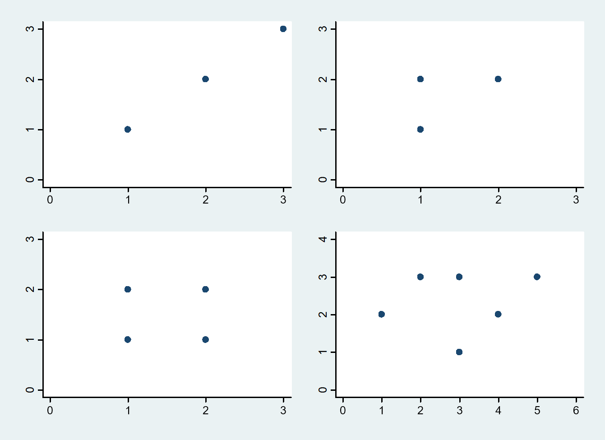

```{r setup, include=FALSE}
knitr::opts_chunk$set(echo = FALSE)
options(digits=1)
```

---

- `data.frame()`   
- `plot(x,y)`   
- `lines()`   
- `lm()`  
- `coef()`  
- `predict()`  
- `resid()`  

---



## Escenario 1

---

```{r, echo=TRUE, eval=FALSE}
escena1 <- data.frame(x <- c(1,2,3), y <- c(1,2,3))
with(escena1,plot(x,y, xlim=c(0,4), ylim=c(0,4), pch=16))
```

---

```{r, eval=TRUE}
escena1 <- data.frame(x <- c(1,2,3), y <- c(1,2,3))
with(escena1,plot(x,y, xlim=c(0,4), ylim=c(0,4), pch=16))
```

---

```{r echo=TRUE, eval=FALSE}
with(escena1,plot(x,y, xlim=c(0,4), ylim=c(0,4), pch=16))
lines(c(0,4), c(0,4), col="red")
```
---

```{r eval=TRUE}
with(escena1,plot(x,y, xlim=c(0,4), ylim=c(0,4), pch=16))
lines(c(0,4), c(0,4), col="red")
```
---

```{r}
with(escena1,plot(x,y, xlim=c(0,4), ylim=c(0,4), pch=16))
lines(c(1,3), c(1,3), col="red")
```

## Escenario 2

---

```{r echo=TRUE, eval=FALSE}
escena2 <- data.frame(x <- c(1,1,2), y <- c(1,2,2))
with(escena2,plot(x,y, xlim=c(0,4), ylim=c(0,4), pch=16))
```
---
```{r eval=TRUE}
escena2 <- data.frame(x <- c(1,1,2), y <- c(1,2,2))
with(escena2,plot(x,y, xlim=c(0,4), ylim=c(0,4), pch=16))
```

### Coeficientes de la recta

```{r, echo=TRUE}
recta2 <- lm(y~x, data = escena2)
coef(recta2)
```

---

```{r echo=TRUE, eval=FALSE}
with(escena2,plot(x,y, xlim=c(0,4), ylim=c(0,4), pch=16))
abline(recta2, col="red")
```
---
```{r eval=TRUE}
with(escena2,plot(x,y, xlim=c(0,4), ylim=c(0,4), pch=16))
abline(recta2, col="red")
```
---
```{r}
with(escena2,plot(x,y, xlim=c(0,4), ylim=c(0,4), pch=16))
abline(recta2, col="red")
for (i in 1:3) {
lines(c(escena2$x[i],c(escena2$x[i])),c(escena2$y[i],predict(recta2)[i])) 
}
```

---
```{r echo=TRUE}
resid(recta2)
```
## Escenario 3

---

```{r}
escena3 <- data.frame(x <- c(1,1,2,2), y <- c(1,2,1,2))
with(escena3,plot(x,y, xlim=c(0,3), ylim=c(0,3), pch=16))
```

### Coeficientes de la recta

```{r}
recta3 <- lm(y~x)
coef(recta3)
```

---

```{r}
with(escena3,plot(x,y, xlim=c(0,3), ylim=c(0,3), pch=16))
abline(recta3, col="red")
```


---
```{r echo=TRUE}
coef(recta3)
```
---
---
```{r}
with(escena3,plot(x,y, xlim=c(0,4), ylim=c(0,4), pch=16))
abline(recta3, col="red")
for (i in 1:6) {
lines(c(escena3$x[i],c(escena3$x[i])),c(escena3$y[i],predict(recta3)[i]))
}
```

## Escenario 4

---

```{r}
escena4 <- data.frame(x <- c(1,2,3,3,4,5), y <- c(2,3,1,3,2,3))
with(escena4,plot(x,y, xlim=c(0,6), ylim=c(0,4), pch=16))
```

### Coeficientes de la recta

```{r, echo=TRUE}
recta4 <- lm(y~x)
coef(recta4)
```

---

```{r}
with(escena4,plot(x,y, xlim=c(0,6), ylim=c(0,4), pch=16))
abline(recta4, col="red")
```

---

```{r}
with(escena4,plot(x,y, xlim=c(0,6), ylim=c(0,4), pch=16))
abline(recta4, col="red")
for (i in 1:6) {
lines(c(escena4$x[i],c(escena4$x[i])),c(escena4$y[i],predict(recta4)[i]))
}
```
