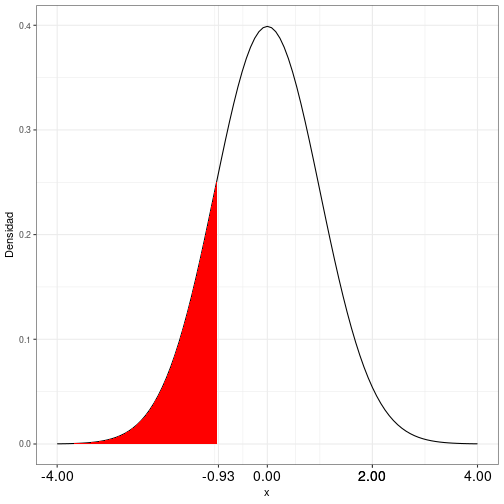

Distribuciones de probabilidad - Cálculo en R
========================================================
author: 
date: 
autosize: true


Distribución binomial
========================================================
$P(X=s)= \left( \begin{array}  n\\ s \end{array} \right)  p^n (1-p)^{(n-s)}$

Función de probabilidad
===
$P(X = s)$  


```r
dbinom(nexitos, nrep, prob)
```

### Ejemplo
Probabilidad de obtener ocho *éxitos* al repetir catorce veces el experimento, con una probabilidad de éxito de 35%.  


```r
dbinom(8,14,0.35)
```

```
[1] 0.05100113
```

Función de distribución
===
$P(X\le s)$


```r
pbinom(q, nrep,prob)
```

### Ejemplo
Probabilidad hasta cuatro *éxitos* al repetir once veces el experimento, con una probabilidad de éxito de 16%.  

```r
pbinom(4,11,0.16)
```

```
[1] 0.9792542
```


Distribución de Poisson
========================================================
$P(X = r)$  
Función de probabilidad
===

```r
dpois(n, lambda)
```

### Ejemplo
Probabilidad de encontrar 3 individuos con una característica, si la media es de 11.  


```r
dpois(3,11)
```

```
[1] 0.003704994
```

Función de distribución
===
$P(X\le r)$

```r
dpois(q, lambda)
```

### Ejemplo
Probabilidad de encontrar hasta 12 individuos con una característica, si la media es 19.  

```r
ppois(12,19)
```

```
[1] 0.06056137
```


Distribución normal
========================================================

Función de distribución
===
$P(x \le z)$

```r
pnorm(x, media, dtipica)
```

Si media = 0 y desviación típica = 1, se puede omitir en la orden: `pnorm(x)`
### Ejemplo

```r
pnorm(1.39)
```

```
[1] 0.9177356
```

Ejemplo 1
===
title: false


===

```r
1-pnorm(0.93)
```

```
[1] 0.1761855
```

Alternativa:

```r
pnorm(0.93, lower.tail=F)
```

```
[1] 0.1761855
```

Ejemplo 2
===
title: false



===


```r
pnorm(-0.93)
```

```
[1] 0.1761855
```

Ejemplo 3
===
title: false


===

```r
pnorm(1.49)-pnorm(0.36)
```

```
[1] 0.2913114
```


Ejemplo 4
===
title: false


===

```r
pnorm(-0.76)-pnorm(-2.08)
```

```
[1] 0.2048645
```


Ejemplo 5
===
title: false


===

```r
pnorm(1.52)-pnorm(-1.52)
```

```
[1] 0.871489
```

Otra forma alternativa para calcular el área señalada:  

```r
1-2*pnorm(-1.52)
```

```
[1] 0.871489
```

Ejemplo 6
===
title: false


===

```r
pnorm(0.85)-pnorm(-1.27)
```

```
[1] 0.7002951
```
